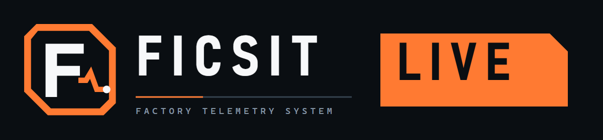
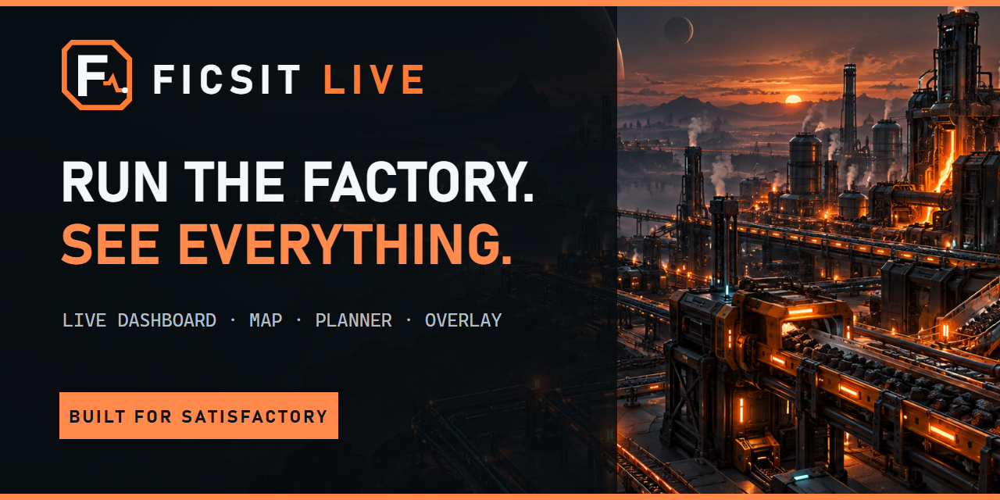
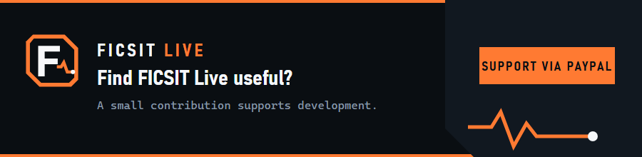

  

  <a href="#english">English</a> · <a href="#nederlands">Nederlands</a>

# FICSIT Live

A live dashboard, a factory map and a production planner for **Satisfactory 1.2**. Everything comes straight from your running game and shows up in your browser and as an overlay on top of the game.

  

**Languages:** English and Dutch. You can add your own, see [Languages](#languages).

## What you need

1. **Satisfactory 1.2** on Windows.
2. **The FicsIt Remote Monitoring mod**, installed with the [Satisfactory Mod Manager](https://smm.ficsit.app/).
3. **Its web server switched on, in the game itself.** Start Satisfactory and go to **Options → FicsIt Remote Monitoring → Web/WebSockets**, and turn on **Autostart**. From then on the web server starts with the game. You only do this once. Rather not? Then type `/frm http start` in the in-game chat every time you play. It listens on port 8080.

## Install

1. **Download [FICSIT-Live-Setup.exe](https://github.com/Eyonator/FicsitLive/releases/latest/download/FICSIT-Live-Setup.exe)** (about 100 MB).
   - If your browser asks whether to keep the file, choose **Keep**. In Edge that is under the three dots next to the download: **Keep → Show more → Keep anyway**.
2. **Double-click the file.**
   - The first time, Windows shows a blue window, *"Windows protected your PC"*. Click **More info**, then **Run anyway**. That is because the program has no paid certificate; it only happens on this first install.
3. **Done.** FICSIT Live installs without further questions, then opens the dashboard in your browser.

You do not need administrator rights. There is a shortcut on your desktop and in the Start menu.

## The dashboard: http://localhost:8420

FICSIT Live is a page in your own browser, at **<http://localhost:8420/>**. That address only works on the pc FICSIT Live runs on. It is not a website on the internet.

Open the dashboard in one of three ways:
- double-click **FICSIT Live** on your desktop or in the Start menu;
- right-click the icon in the tray (bottom right, by the clock) and choose **Open the dashboard**;
- type `localhost:8420` in your browser's address bar. Feel free to bookmark it.

This is where you find power, machines, the map of your factory and the planner.

## The overlay in the game

- **FICSIT Live starts by itself when you sign in** and waits quietly in the tray.
- **Start Satisfactory** and the overlay appears on top of the game by itself. That works in *Fullscreen* and in *Borderless window*.
- **F9** shows and hides it, and **Shift+F9** lets your clicks through to the game.
- The **Open in browser** button at the top of the overlay opens the same dashboard full size in your browser.

## Updating

FICSIT Live checks for a new version every half hour and downloads it in the background. Don't want to wait? Click **Look for updates** at the bottom of the dashboard, next to the version number.

- When one is ready, an **Update** button appears at the top of the dashboard and the overlay. Clicking it tells you what changes and how updating goes.
- It is only installed once you click **Update now**. The tray icon offers the same.
- The game may keep running. FICSIT Live is gone for about half a minute, starts again by itself, and the page reloads itself.
- Your projects and settings stay. Updates bring no warning from Windows.
- **Stable or Beta.** A new download is on **Stable**: you only get the big versions, such as 0.4 to 0.5. On **Beta** you get every version, the small ones in between too. You choose under **Settings**. Going back from Beta to Stable never puts an older version on your pc; you keep yours until a newer stable one is out.

## Settings

Since version 0.4.21.0 the dashboard has a **Settings** page.

- **The overlay:** hotkeys, width, height, side of the screen, opacity and the language of the tray menu. Changes take effect at once, even while the game runs. A tablet may change these too.
- **The app:** starting at sign-in, looking for updates, whether a tablet may connect, and a folder with your own translations. These can only be changed on the pc itself. Who may connect and the translations folder need a short restart of the bridge; the page explains that first and asks you to confirm. The game and the overlay keep running.
- **The dashboard on a tablet:** under **Reachable from**, choose *Also a tablet or another device on your network*. Windows asks once whether to open the firewall. On the tablet, go to `http://<your-pc's-ip>:8420/`.

The settings live in `%APPDATA%\FICSIT Live` (`settings.json` and `overlay.config.json`). Editing them by hand still works, and shows up on the page.

## Languages

FICSIT Live speaks **English** and **Dutch**. Pick the language at the top right of the dashboard; the tray menu has its own setting on the Settings page.

**Your own translation:**
1. Copy [`locales/en.json`](locales/en.json) to a folder of your own and name the copy after your language code, for example `de.json`.
2. Translate the values and leave the keys alone. `{words in braces}` are filled in by the app: keep them.
3. On the **Settings** page, set **Folder with translations** to that folder and confirm the restart. Your language now appears in the language menu. Anything you have not translated yet shows in English.

**Share it:** open a pull request in this repository that adds `locales/<code>.json`. See [`locales/README.md`](locales/README.md). An accepted translation ships with the next release.

## Uninstalling

Through **Windows Settings → Apps → Installed apps → FICSIT Live → Uninstall**. Your projects stay in `%APPDATA%\FICSIT Live` until you delete that folder yourself.

## Something not working?

Look in `%APPDATA%\FICSIT Live`:
- `app.log` says what the app does;
- `bridge.log` says what the connection with the game does;
- `updater.log` says what the updates do.

Send those three files along with your question or remark.

## What is here

The releases hold the installer and the changes per version. The translations live in [`locales/`](locales/). The source code is not in this repository.

FICSIT Live is an unofficial companion project for Satisfactory and is not affiliated with Coffee Stain Studios. Satisfactory and related marks belong to their respective owners.

---

# FICSIT Live (Nederlands)

Een live dashboard, een fabriekskaart en een productieplanner voor **Satisfactory 1.2**. Alles komt rechtstreeks uit je draaiende game en verschijnt in je browser en als overlay over de game.

**Talen:** Engels en Nederlands. Je kunt er zelf een toevoegen, zie [Talen](#talen).

## Wat je nodig hebt

1. **Satisfactory 1.2** op Windows.
2. **De mod FicsIt Remote Monitoring**, te installeren via de [Satisfactory Mod Manager](https://smm.ficsit.app/).
3. **De webserver van die mod aan, in de game zelf.** Start Satisfactory, ga naar **Options → FicsIt Remote Monitoring → Web/WebSockets** en zet **Autostart** aan. Vanaf dan start de webserver met de game mee. Dat doe je één keer. Liever niet? Typ dan elke keer dat je speelt `/frm http start` in de chat van de game. Hij luistert op poort 8080.

## Installeren

1. **Download [FICSIT-Live-Setup.exe](https://github.com/Eyonator/FicsitLive/releases/latest/download/FICSIT-Live-Setup.exe)** (ongeveer 100 MB).
   - Vraagt je browser of je het bestand wilt behouden, kies dan **Behouden**. In Edge zit dat onder de drie puntjes naast de download: **Behouden → Meer weergeven → Toch behouden**.
2. **Dubbelklik op het bestand.**
   - Windows toont de eerste keer een blauw venster, *"Windows heeft uw pc beschermd"*. Klik op **Meer info** en dan op **Toch uitvoeren**. Dat komt doordat het programma geen betaald certificaat heeft; het gebeurt alleen bij deze eerste installatie.
3. **Klaar.** FICSIT Live installeert zich zonder verdere vragen, en daarna opent het dashboard in je browser.

Je hebt geen beheerdersrechten nodig. Er staat een snelkoppeling op je bureaublad en in het Startmenu.

## Het dashboard: http://localhost:8420

FICSIT Live is een pagina in je eigen browser, op **<http://localhost:8420/>**. Dat adres werkt alleen op de pc waar FICSIT Live draait. Het is geen website op internet.

Je opent het dashboard op drie manieren:
- dubbelklik op **FICSIT Live** op je bureaublad of in het Startmenu;
- klik met rechts op het icoon in het systeemvak (rechtsonder, bij de klok) en kies **Dashboard openen**;
- typ `localhost:8420` in de adresbalk van je browser. Zet het gerust bij je favorieten.

Hier staan de energie, de machines, de kaart van je fabriek en de planner.

## De overlay in de game

- **FICSIT Live start vanzelf als je inlogt** en wacht stil in het systeemvak.
- **Start je Satisfactory**, dan verschijnt de overlay vanzelf over de game. Dat werkt in *Volledig scherm* en in *Randloos venster*.
- Met **F9** toon en verberg je hem, en met **Shift+F9** klik je erdoorheen naar de game.
- Met de knop **In browser openen** bovenin de overlay open je hetzelfde dashboard groot in je browser.

## Bijwerken

FICSIT Live kijkt elk half uur of er een nieuwe versie is en haalt die op de achtergrond binnen. Niet willen wachten? Klik onderin het dashboard, naast het versienummer, op **Zoeken naar updates**.

- Staat er een klaar, dan zie je bovenin het dashboard en in de overlay een knop **Update**. Een klik vertelt wat er verandert en hoe het bijwerken gaat.
- Pas als jij op **Nu bijwerken** klikt, wordt hij geïnstalleerd. Dat kan ook via het icoon in het systeemvak.
- De game mag gewoon blijven draaien. FICSIT Live is ongeveer een halve minuut weg, start daarna vanzelf opnieuw, en de pagina laadt zichzelf opnieuw.
- Je projecten en instellingen blijven staan. Bij updates komt er geen waarschuwing van Windows.
- **Stabiel of Beta.** Een nieuwe download staat op **Stabiel**: je krijgt alleen de grote versies, zoals 0.4 naar 0.5. Op **Beta** krijg je elke versie, ook de kleine tussendoor. Je kiest het bij **Instellingen**. Van Beta terug naar Stabiel zet nooit een oudere versie op je pc; je houdt de jouwe tot er een nieuwere stabiele is.

## Instellingen

Sinds versie 0.4.21.0 heeft het dashboard een pagina **Instellingen**.

- **De overlay:** sneltoetsen, breedte, hoogte, kant van het scherm, dekking en de taal van het systeemvak. Wijzigingen werken meteen, ook terwijl de game draait. Dit mag ook vanaf een tablet.
- **De app:** starten bij het inloggen, zoeken naar updates, of een tablet verbinding mag maken, en een map met eigen vertalingen. Die kun je alleen op de pc zelf wijzigen. Wie verbinding mag maken en de map met vertalingen vragen een korte herstart van de bridge; de pagina legt dat eerst uit en vraagt je te bevestigen. De game en de overlay blijven draaien.
- **Het dashboard op een tablet:** kies bij **Bereikbaar vanaf** voor *Ook een tablet of een ander apparaat in je netwerk*. Windows vraagt dan één keer of het de firewall mag openen. Op de tablet ga je naar `http://<ip-van-je-pc>:8420/`.

De instellingen staan in `%APPDATA%\FICSIT Live` (`settings.json` en `overlay.config.json`). Met de hand aanpassen kan nog steeds, en dat zie je dan ook op de pagina.

## Talen

FICSIT Live spreekt **Engels** en **Nederlands**. De taal kies je rechtsboven in het dashboard; het systeemvak heeft een eigen instelling op de pagina Instellingen.

**Een eigen vertaling:**
1. Kopieer [`locales/en.json`](locales/en.json) naar een eigen map en noem de kopie naar de code van je taal, bijvoorbeeld `de.json`.
2. Vertaal de waarden en laat de sleutels staan. `{woorden tussen accolades}` vult de app zelf in: laat ze staan.
3. Zet op de pagina **Instellingen** de **Map met vertalingen** op die map en bevestig de herstart. Je taal staat nu in de taalkeuze. Wat je nog niet vertaald hebt, verschijnt in het Engels.

**Delen:** open in deze repository een pull request dat `locales/<code>.json` toevoegt. Zie [`locales/README.md`](locales/README.md). Een aangenomen vertaling gaat mee met de volgende release.

## Verwijderen

Via **Windows-instellingen → Apps → Geïnstalleerde apps → FICSIT Live → Verwijderen**. Je projecten blijven in `%APPDATA%\FICSIT Live` staan, tot je die map zelf weggooit.

## Werkt er iets niet?

Kijk in `%APPDATA%\FICSIT Live`:
- `app.log` zegt wat de app doet;
- `bridge.log` zegt wat de verbinding met de game doet;
- `updater.log` zegt wat de updates doen.

Stuur die drie bestanden mee met je vraag of opmerking.

## Wat hier staat

In de releases staan het setup-bestand en de wijzigingen per versie. De vertalingen staan in [`locales/`](locales/). De broncode staat niet in deze repository.

FICSIT Live is een onofficieel hulpproject voor Satisfactory en is niet verbonden aan Coffee Stain Studios. Satisfactory en de bijbehorende merken zijn van hun respectieve eigenaren.

---

  

